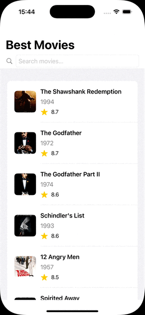

# BestMovies
## Setup instructions

Copy the file `BestMovies/Configuration.swift.template` to `BestMovies/Configuration.swift` and replace the `"<API-KEY>"` placeholder with your TMDB API key. The API key can be obtained from https://www.themoviedb.org/settings/api

## Project settings

- Targeting iPhone with iOS 15.6 as minimum deployment target
- Xcode 16.3.0
- Swift 5.10

The 15.6 target allows us to use SwiftUI 3.0, Swift Concurrency, and Combine.

In particular allows us to use `NavigationStack` to build the `Coordinator`. In lower iOS versions SwiftUI navigation is still not mature enough and we should resort to UIKit navigation and wrap SwiftUI views in `UIHostingController`.

> Note: There's a known networking bug on Simulator for iOS 18.4. Please use a lower iOS version if you test on a Simulator (for example iOS 18.3.1)
> See: https://developer.apple.com/forums/thread/777999

### External dependency management
This project uses Swift Package Manager to manage the following third party dependencies:

- **Quick and Nimble:** To provide writing unit testing using a BDD approach.
	- https://github.com/Quick/Quick
	- https://github.com/Quick/Nimble
- **Factory:** Container-based dependency injection.
	- https://github.com/hmlongco/Factory

## Modularization

The `main` branch contain the application organized in logical layers.

The `feature/modularization` branch contains a version of the application with each layer in separate SPM packages:

- **Features**
	- **Movies**: Implementation of the feature that displays a searchable list of movies an their detail.
	- **CommonUI**: Common UI elements that can be reused across packages.
- **Domain**
	- **BestMoviesDomain**: The domain logic for the application.
- **Data**
	- **TMDBDataSource**: Gives access to TheMovieDataBase data using their API and performs the necessary data mapping.
- **Services**
	- **TMDBAPI**: Provides access to TheMovieDataBase API.
	- **Networking**: Enables performing network requests.

## Functional description
BestMovies is an iOS application that allows users to browse the top rated movies from The Movie Database (TMDB). It consists of a main list view of movies, including a search bar, and a child view that displays movie details.

## Architecture approach
The app follows Clean Architecture principles with a pragmatic approach. The current state provides reasonable separation of concerns and would allow different teams to work independently on features and layers. The tradeoffs would need to be evaluated if additional additional abstractions and complexity would bring benefits, for example to adapt to the needs of the product, team organization or ways of working.

### Domain layer
A Domain layer holds use cases that hold business logic and data model entities. The business logic is inherently simple because most of the functionality is delegated to queries performed to the TMDB API. However, having this layer provides a reasonable foundation for growth and easy maintenance.

### Presentation layer
Provides the facilities to present information to the user and receive their actions. Follows the MVVM architectural pattern with the views implemented in SwiftUI.

This layer depends on the Domain layer.

#### Coordinator
The Coordinator pattern is used to facilitate navigation, so each view is agnostic of the details of navigation and their position in the view hierarchy. This will enable teams to work independently on features more easily and enable view reutilisation and composition.

#### View Entities
The presentation layer uses Domain entities directly as view entities. This is a conscious pragmatic decision for simplicity, as the current presentation is heavily influenced by the Domain entities structure (in turn closely matches the Data source DTO), with little formatting needed. Once the needs of the product evolve and views become more complex, it should be considered if the effort to add view specific data entities and mapping infrastructure is deserved. 

#### View model state
A state enum is useed to keep track of the states that the view will experience: idle, loading, loaded, error.

The data associated to each state is also embedded into the same enum. Having a single state poperty instead of several properties that define the configuration of the the view is very useful in our case. As it communicates clearly what combinations of values are valid. For example, the array that holds the values to display is only present in the `loaded` state. This makes understanding the flow and testing very straightforward, for example combinations of values that are not valid are simply not possible.  

### Data layer
Provides access to data through repositories and access to external data sources through APIs. And importantly, the mappers to convert the objects received from external data sources to the domain entities.
This layer only depends on the Domain layer.

### Infrastructure layer
Implements the interfaces to access data through the network.

### Dependency injection
Dependency injection is used as the creational pattern, following a Container-Based approach.
The implementation is pragmatic, and provides the minimum infrastructure to provide a centralized point for the configuration and creation and composition of all objects from all layers.
The dependency injection is also the place that reads configuration values and injects them when they are needed (namely API URLs and API authentication key)

## Testing
Unit tests are written using Quick and Nimble. This leads to a natural description of test cases and expectations, that are easy to understand in a BDD style.

### UI testing
UI test are more expensive to create and maintan, and usualy very fragile and flaky. Used for cases where UI specific behaviours that can't be covered by unit tests.

Can be used to cover the critical flows, and to reproduce bug scenarios and ensure that there are no regressions.

## Security
Security should start with threat and risk assessment to guide our strategy. In this case the main risk is that an attacker gets hold of our third party API key and abuses it or accesses data on our behalf.

### Protecting the keys during development
Care must be taken not to expose the API key in source code repositories. To this effect in this project the API key is only available in a configuration source code file `Configuration.swift` that each developer must create from a template and provide the API key value. This file is ignored by git and should never be committed. 

When building our apps in our CI/CD infrastructure the API key can be stored securely (for example using Github Actions secrets). And only injected during the build step.

### Protecting the keys in production
On apps that we distribute to customers, protecting the keys is unfortunately a lost battle due to the nature of how the binaries a generated and the app resources packaged and distributed.

There's no question that a motivated attacker will eventually get hold of our API keys. However, we can take steps to delay the simpler attacks. For example, in this project that API key is kept in a source code file instead of a `.plist` or `.xconfig`. Because the contents of these files are easily available by casually inspecting the IPA package, but for strings compiled into the source code it takes another step with the `strings` or `otool` tools.

Additional layers with obfuscation and encryption can be added even when using `.xconfig` files But usually our risk assessment will point us to a more robust solution as described next.

### Protect the keys by not exposing them to clients
When a significant risk exists as a result of exposing our API keys it's usually a good solution to create our own backend proxy. This proxy uses the API key that is only available server-side, receives mobile client requests, and uses this server-side API key to performs the queries agains the third party API.

As we control this backend proxy we can can implement more robust security using:
- OAuth 2.0 authentication
- SLL certificate pinning
- App Attest using DeviceCheck services

## Demo

